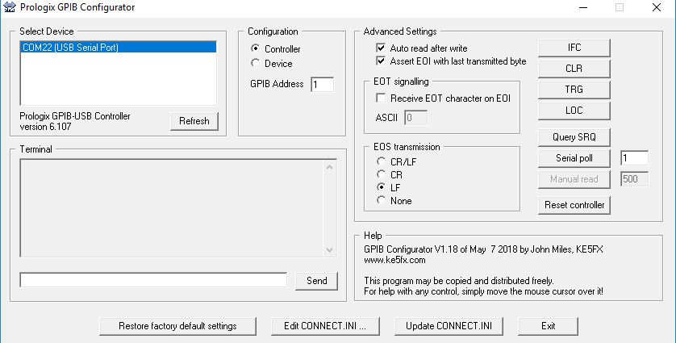
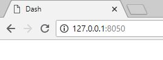
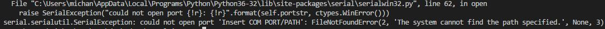
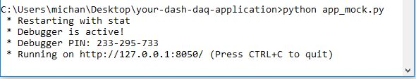

# Dash-HP-Agilent-34401A-Multimeter


## Introduction
An application that allows the user to control an Agilent HP 34401A Multimeter. [Play with the app here](https://dash-daq-hp-multimeter.herokuapp.com/) and learn more about this application from our [blog entry](https://www.dashdaq.io/read-agilent-34401a-multimeter-in-python). 


### Multimeter
The HP Agilent 34401A Multimeter is a popular electric data aqcuistion device used, in laboratories around the world. They key feautures of a multimeter are its ability to measure voltage and current. Voltage is measured by creating a parallel line from point A to B, which reads out the voltage difference bewtween these two points. Current is measured by passing the current of a circuit through itself, in series. It is important that these instructions are followed carefully, to not blow any fuses within the device.


### dash-daq
[Dash DAQ](http://dash-daq.netlify.com/#about) is a data acquisition and control package built on top of Plotly's [Dash](https://plot.ly/products/dash/). It gives users more accesibility and, key features for data aquistion applications.


## How to use the app
There are two versions of this application. A mock version for the user to play with, without any instruments connected, and a local version, that can be connected to a device.

### Local Application
If you would like to run the **local version**, please connect the [Prologix GPIB](http://prologix.biz/gpib-usb-controller.html) located at the back of multimeter, to the PC via USB. If this is your first time connecting the multimeter to your PC, ensure the serial communication address of the HP multimeter, and the Prologix GPIB are the same. 

You can check/change the address of the multimeter by going to:

Settings -> I/O Menu -> HP-IB ADDR -> **Address**

For the Prologix GPIB, you will have to use the **Prologix GPIB Configurator** which can be found under utilities [here](http://prologix.biz/resources.html). Here is a screen shot of what the Prologix GPIB settings should be (Note: Your COM PORT may not be the same as mine):



When you are ready, run the following line of code in your command line to initialize the application:

``` 
python app.py
```


and you should see this:


Open the web address given to you in your browser and the application will be ready for use:



If the app is run, but the device is not connected you will see something like this:



If connection issues arise, try the following:
1. Unplug and plug back in the USB connection and the Prologix GPIB bus
2. Restart computer

### Mock Application
If you would like to run the __**mock version**__, run in the command line:

```
python app_mock.py 
```


and you should see this:



Open the web address given to you in your browser and the application will be ready for use:


### Controls
* DC V: Measure DC voltage.
* AC V: Measure AC voltage.
* DC I: Measure DC current.
* AC I: Measure AC current.
* 2 W: Measure resistance upto 2 watts.
* 4 W: Measure resistance upto 4 watts.
* Frequency: Measure frequency in hz.
* Period: Measure period in seconds.
* Continuity: Check if continuous circuit (not open).
* Diode: Diode check.
* Acquisition: Capture data from measurements. Manual is every button press, and continuous captures data every second.
* Measure: Press to start capturing data.
* Range: The range of the measurement measured. Reads out data based on a set scale. E.g. reading 10 V DC at a scale of 100 V DC or 5 VDC.

## Resources
PySerial was used for serial communication. The API for PySerial can be found [here](http://pyserial.readthedocs.io/en/latest/pyserial_api.html). For a further understanding of how the multimeter works, and the SCPI langauge used to communicate check out the manual [here](http://ecee.colorado.edu/~mathys/ecen1400/pdf/references/HP34401A_BenchtopMultimeter.pdf). If you need help connecting the Prologix GPIB, need drivers, or the GPIB configurator refer [here](http://prologix.biz/), and [here](http://prologix.biz/resources.html).
